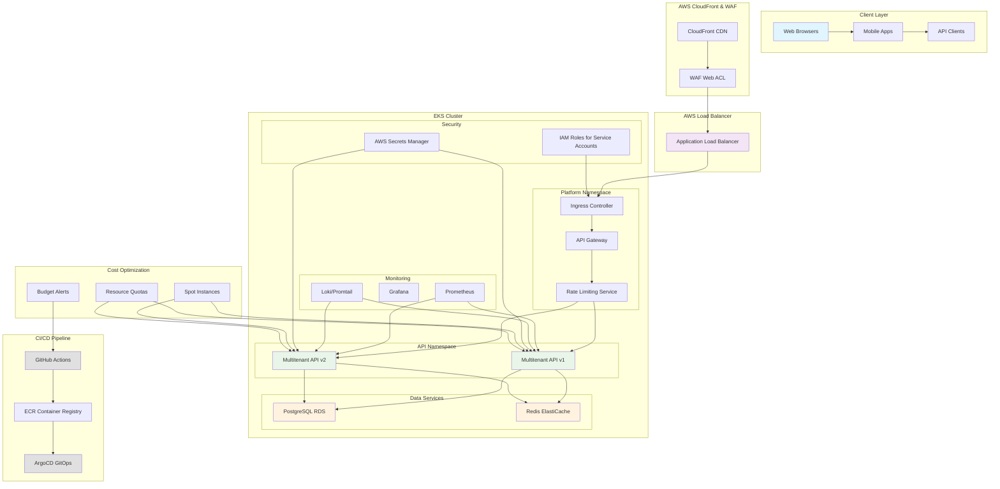
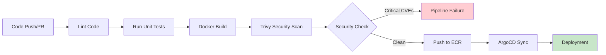

# Multi-Tenant SaaS Platform Documentation

## Overview

This repository contains the complete infrastructure and application code for a multi-tenant SaaS platform built on AWS EKS. The platform provides a scalable, secure, and cost-effective solution for serving multiple tenants with proper isolation and resource optimization.

## Architecture Diagram

## Security Model

### Authentication & Authorization
- **JWT-based Authentication**: Each tenant receives a JWT containing their tenant ID
- **Role-Based Access Control**: Fine-grained permissions based on tenant roles
- **API Gateway**: Centralized authentication and request validation

### Infrastructure Security
- **IAM Roles for Service Accounts (IRSA)**: Secure AWS resource access without long-term credentials
- **Network Policies**: Isolate workloads within the cluster
- **Pod Security Standards**: Enforce security best practices at the pod level
- **Secrets Management**: AWS Secrets Manager for sensitive configuration data
- **WAF Rules**: Web Application Firewall protection against common attacks

### Data Security
- **Tenant Isolation**: Logical separation using tenant_id in database queries
- **Encryption at Rest**: All data encrypted using AWS KMS
- **Encryption in Transit**: TLS 1.3 for all internal and external communications
- **Database Security**: RDS with VPC, security groups, and parameter groups

### Container Security
- **Image Scanning**: Trivy integration in CI/CD pipeline to detect vulnerabilities
- **Non-root Execution**: Containers run as non-root users
- **Resource Limits**: Prevent resource exhaustion attacks
- **Immutable Images**: Production images are immutable and versioned

## CI/CD Flow

### GitHub Actions Pipeline

### Pipeline Stages
1. **Code Quality**: Linting and static analysis
2. **Testing**: Unit tests and integration tests
3. **Build**: Multi-stage Docker build with security best practices
4. **Security**: Trivy vulnerability scanning with security gate
5. **Registry**: Push to AWS ECR with proper tagging
6. **Deployment**: GitOps deployment via ArgoCD

### GitOps with ArgoCD
- **App-of-Apps Pattern**: Each service deployed as a separate ArgoCD application
- **Environment Promotion**: Git-based promotion through dev → staging → prod
- **Automated Sync**: Continuous reconciliation between Git and cluster state
- **Health Checks**: Automated health assessment of deployed applications

## Failure Scenarios

### Pod Failure
- **Detection**: Kubernetes liveness/readiness probes and monitoring alerts
- **Impact**: Temporary service degradation for affected requests
- **Mitigation**: Kubernetes automatically restarts failed pods; HPA ensures adequate replicas
- **Rollback**: ArgoCD can automatically rollback to previous stable version

### AZ Outage
- **Detection**: CloudWatch metrics and multi-AZ health checks
- **Impact**: Potential service disruption if all instances in an AZ fail
- **Mitigation**: Multi-AZ deployment with proper pod anti-affinity rules
- **Recovery**: Automatic failover to healthy AZs; cluster autoscaler provisions new nodes

### DB Failover
- **Detection**: Database connection monitoring and performance metrics
- **Impact**: Temporary read/write unavailability during failover
- **Mitigation**: RDS Multi-AZ deployment with read replicas
- **Recovery**: Automatic failover to standby instance; application retry logic

### Bad Deploy
- **Detection**: SLO-based analysis during blue/green or canary deployments
- **Impact**: Service degradation or errors for affected users
- **Mitigation**: Automated rollback based on success rate, error rate, and latency metrics
- **Recovery**: Immediate rollback to previous stable version with alert notification

## Trade-offs

### Performance vs Cost
- **Trade-off**: Using spot instances for significant cost savings vs potential interruptions
- **Decision**: Implemented graceful spot interruption handling to maintain availability
- **Rationale**: 70-90% cost savings justify the complexity of interruption handling

### Security vs Usability
- **Trade-off**: Strict security policies vs developer convenience
- **Decision**: Implemented zero-trust security model with automated tooling
- **Rationale**: Security is paramount for multi-tenant platform; automation reduces friction

### Scalability vs Complexity
- **Trade-off**: Microservices architecture for scalability vs increased operational complexity
- **Decision**: Modular monolith approach with clear service boundaries
- **Rationale**: Balances scalability needs with operational simplicity for initial scale

### Consistency vs Availability
- **Trade-off**: Strong consistency for data integrity vs high availability
- **Decision**: Eventual consistency for non-critical data with strong consistency for critical operations
- **Rationale**: Multi-tenant platform requires both good performance and data integrity

### Observability vs Performance
- **Trade-off**: Comprehensive monitoring vs application performance overhead
- **Decision**: Selective instrumentation with sampling for high-volume endpoints
- **Rationale**: Critical to maintain observability for troubleshooting without impacting performance

## Key Components

### Multi-Tenant API
- **Technology**: Go with PostgreSQL and Redis
- **Features**: Tenant isolation, rate limiting, JWT authentication
- **Metrics**: RED (Rate, Error, Duration) metrics collection

### Infrastructure
- **Platform**: AWS EKS with managed node groups
- **Database**: RDS PostgreSQL with Multi-AZ
- **Cache**: ElastiCache Redis for session and rate limiting
- **Load Balancer**: Application Load Balancer with WAF

### Monitoring & Observability
- **Metrics**: Prometheus with custom application metrics
- **Visualization**: Grafana dashboards for monitoring
- **Logging**: Loki for structured log aggregation
- **Alerting**: AlertManager with SLO-based alerts

### Deployment Strategy
- **Pattern**: Blue/Green with canary traffic shifting
- **Tools**: Argo Rollouts for advanced deployment strategies
- **Validation**: SLO-based analysis during deployments
- **Rollback**: Automated rollback on SLO breach

## Cost Controls

### Spot Instances
- Up to 90% cost savings on compute resources
- Graceful interruption handling for availability
- Mixed On-Demand/Spot node groups for stability

### Rightsizing
- VPA for automated resource optimization
- Resource quotas and limits for cost control
- Continuous monitoring and adjustment

### Budget Management
- AWS Budgets with threshold alerts
- Tag-based cost allocation and tracking
- Automated monitoring via CronJobs

## Getting Started

For detailed deployment and operational procedures, see the [runbooks](../runbooks/) directory.

### Prerequisites
- AWS account with appropriate permissions
- Kubernetes cluster (EKS)
- Docker and kubectl installed
- ArgoCD installed for GitOps deployment

### Deployment
1. Configure AWS credentials and region
2. Set up EKS cluster with required components
3. Deploy infrastructure using Terraform
4. Install ArgoCD and configure GitOps
5. Deploy applications via ArgoCD

This documentation provides a comprehensive overview of the multi-tenant SaaS platform architecture, security model, deployment processes, and operational procedures.